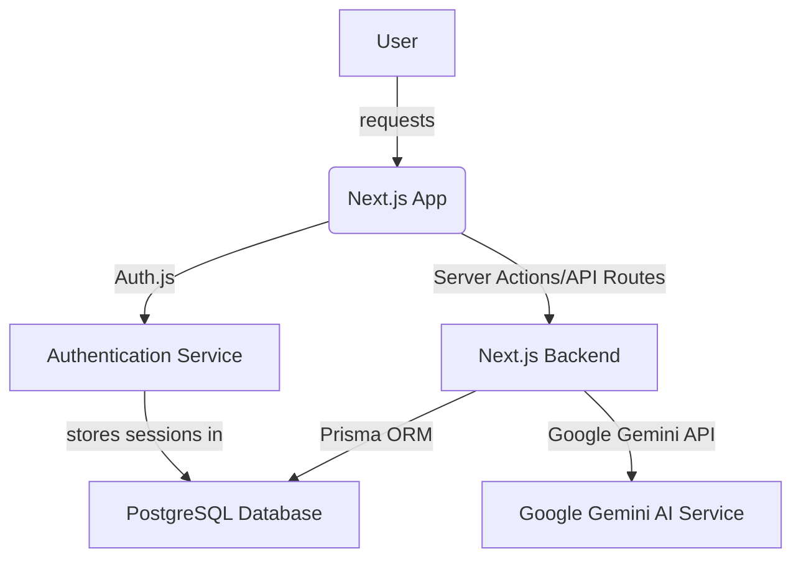

# AI Career Navigator - Project Plan

## 1. Assignment Analysis

The goal is to build a production-ready SaaS platform called "AI Career Navigator" that helps users manage their career growth. The platform will offer features such as profile creation, skill management, project tracking, certification management, job application tracking, resume uploads with AI feedback, AI skill-gap analysis, and AI career recommendations.

### Technology Stack:

*   **Frontend:** Next.js 16 App Router, TypeScript, Tailwind CSS, shadcn/ui
*   **Backend:** Next.js Server Actions, API Routes (where necessary)
*   **Database:** PostgreSQL, Prisma ORM
*   **Authentication:** Auth.js, Credentials login
*   **Authorization:** Role Based Access Control (USER, ADMIN)
*   **Validation:** Zod, React Hook Form
*   **AI:** Google Gemini
*   **Testing:** Vitest, Playwright
*   **Deployment:** Vercel

## 2. System Architecture Design

The system will follow a modern full-stack Next.js architecture, leveraging the App Router for both frontend rendering and backend API/Server Actions. This approach provides a unified development experience and efficient data fetching.

### High-Level Architecture:



### Components:

*   **Next.js App (Frontend & Backend):** Serves as the primary interface for users and handles server-side logic.
    *   **Frontend:** Built with React components, TypeScript, Tailwind CSS, and shadcn/ui for a modern and responsive UI.
    *   **Backend (Server Actions/API Routes):** Handles data mutations, complex business logic, and interactions with the database and AI services.
*   **PostgreSQL Database:** Stores all application data, including user profiles, skills, projects, certifications, job applications, and authentication details.
*   **Prisma ORM:** Provides a type-safe and efficient way to interact with the PostgreSQL database from the Next.js backend.
*   **Auth.js:** Manages user authentication, supporting credentials-based login.
*   **Google Gemini AI Service:** Provides AI capabilities for resume feedback, skill-gap analysis, and career recommendations.

## 3. Database Schema Design

The database schema will be designed to support all user features and maintain data integrity. Prisma Schema will be used to define the models and their relationships.

```prisma
// schema.prisma

generator client {
  provider = "prisma-client-js"
}

datasource db {
  provider = "postgresql"
  url      = env("DATABASE_URL")
}

model User {
  id            String    @id @default(uuid())
  name          String?
  email         String    @unique
  password      String
  image         String?
  role          Role      @default(USER) // For authorization
  createdAt     DateTime  @default(now())
  updatedAt     DateTime  @updatedAt
  Profile       Profile? // One-to-one relationship with Profile
  skills        Skill[]
  projects      Project[]
  certifications Certification[]
  jobApplications JobApplication[]
}

model Profile {
  id          String   @id @default(uuid())
  userId      String   @unique
  user        User     @relation(fields: [userId], references: [id])
  bio         String?
  linkedinUrl String?
  githubUrl   String?
  resumeUrl   String?
  createdAt   DateTime @default(now())
  updatedAt   DateTime @updatedAt
}

model Skill {
  id        String   @id @default(uuid())
  name      String
  proficiency Int      @default(0) // e.g., 1-5
  userId    String
  user      User     @relation(fields: [userId], references: [id])
  createdAt DateTime @default(now())
  updatedAt DateTime @updatedAt

  @@unique([userId, name])
}

model Project {
  id          String   @id @default(uuid())
  name        String
  description String?
  startDate   DateTime?
  endDate     DateTime?
  userId      String
  user        User     @relation(fields: [userId], references: [id])
  createdAt   DateTime @default(now())
  updatedAt   DateTime @updatedAt
}

model Certification {
  id            String   @id @default(uuid())
  name          String
  issuingBody   String?
  issueDate     DateTime?
  expirationDate DateTime?
  credentialUrl String?
  userId        String
  user          User     @relation(fields: [userId], references: [id])
  createdAt     DateTime @default(now())
  updatedAt     DateTime @updatedAt
}

model JobApplication {
  id            String   @id @default(uuid())
  company       String
  jobTitle      String
  applicationDate DateTime
  status        String // e.g., Applied, Interviewing, Offered, Rejected
  jobUrl        String?
  resumeUsedUrl String?
  userId        String
  user          User     @relation(fields: [userId], references: [id])
  createdAt     DateTime @default(now())
  updatedAt     DateTime @updatedAt
}

enum Role {
  USER
  ADMIN
}
